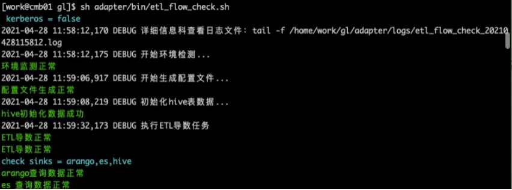
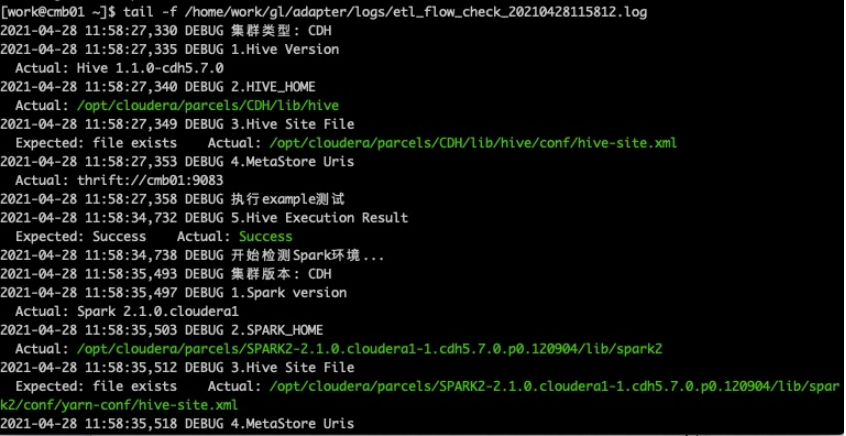
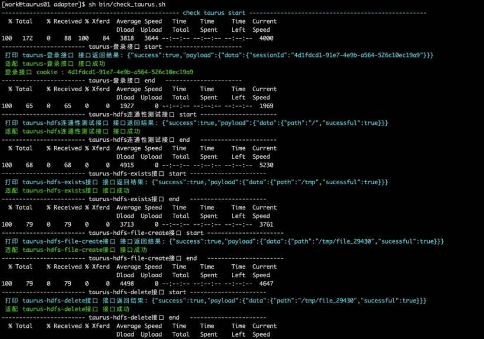

大数据平台适配工具adapter

## 1.介绍
​       由于客户方的大数据集群环境复杂多变，适配工作占用太多人力及时间，该工具支持在自动化部署服务前检测不同平台组件的版本等信息，通过运行HDFS、Hive、Spark等测试用例来验证集群环境是否可用，提升运维部署效率

## 2.Adapter 目录结构
```
adapter
├── bin	#启动目录存放导数/环境监测/启动脚本/初始化等脚本，所有脚本均可单独执行
│   ├── check_arango.sh	#检查arango结果数据脚本
│   ├── check_es.sh		#检查arango结果数据脚本
│   ├── check_hive.sh		#检查hive结果数据脚本
│   ├── check_taurus.sh	#检查taurus: hdfs/hive 接口脚本
│   ├── env_check_tool.sh#环境检查脚本，支持华为FI 、星环环境
│   ├── etl_flow_check.sh #自动化脚本实现总流程控制
│   ├── function.sh		#函数脚本
│   ├── init_config.sh		#初始化./conf/config/adapter.properties 配置脚本
│   ├── load_data_hive.sh #初始化hive表及加载数据脚本
│   ├── runAuth.sh		#启动kerberos认证环境spark-etl脚本
│   └── run.sh			#启动无认证spark-etl脚本
├── conf	#环境配置及模板目录
│   ├── config					#环境配置目录
│   │   ├── adapter.ini			#sh脚本所需的参数文件
│   │   └── adapter.properties		#总配置文件，详情见2
│   ├── data						#hive数据目录
│   │   ├── table_data_edge.txt	#关系表数据
│   │   └── table_data_vertex.txt	#顶点表数据
│   ├── instance					#模板生成spark-etl参数目录
│   │   ├── edge					#边实例目录
│   │   │   ├── hive2All.json		#根据adapter.properties配置生成写入下游入参
│   │   │   ├── hive2arango.json	#hive->arango 启动参数
│   │   │   ├── hive2es.json		#hive->es启动参数
│   │   │   └── hive2hive.json		#hive->hive启动参数
│   │   ├── others				#hive初始化表使用的scala文件目录
│   │   │   └── Load.scala		#初始化hive 的scala文件
│   │   └── vertex				#点实例目录
│   │       ├── hive2All.json		#根据adapter.properties配置生成写入下游入参
│   │       ├── hive2arango.json	#hive->arango 启动参数
│   │       ├── hive2es.json		#hive->es启动参数
│   │       └── hive2hive.json		#hive->hive启动参数
│   └── template					#模板目录，用来生成instance目录下的文件
│       ├── edge					#边模板目录
│       │   ├── hive2All.json
│       │   ├── hive2arango.json
│       │   ├── hive2es.json
│       │   ├── hive2hbase.json
│       │   └── hive2hive.json
│       ├── others				#hive初始化模板目录
│       │   └── Load.scala
│       └── vertex				#顶点模板目录
│           ├── hive2All.json
│           ├── hive2arango.json
│           ├── hive2es.json
│           ├── hive2hbase.json
│           └── hive2hive.json
├── lib							#jar目录
│   └── etl-kgp-loader-*.jar	
└── logs            #etl_flow_check.sh脚本启动的日志目录, 启动一次会生成一个log文件，可按最新文件查看
```

## 3.adapter.properties详细配置

```properties
#是否开启kerberos认证，默认false
kerberos.enable=false
kerberos.principal=kgp		
kerberos.keytab.path=/home/work/gl/adapter/conf/kerberos/user.keytab

#流程控制生成边或顶点的spark-etl启动参数
graph.type=vertex,edge

#sink流程节点, 多个sink用逗号分隔, 暂不支持hbase
sink.flow.nodes=arango,es,hive

#taurus服务配置
taurus.url=localhost
taurus.port=5300

#source hive 配置
source.hive.database=test_etl
source.vertex.hive.table=t_vertex
source.edge.hive.table=t_edge
#source.data.vertex.path=/home/work/gl/adapter/conf/data/table_data_vertex.txt
#source.data.edge.path=/home/work/gl/adapter/conf/data/table_data_edge.txt

#hive sink 库名表名配置
sink.hive.database=test_etl
#hive vertex
sink.vertex.hive.table=sink_vertex
#hive edge
sink.edge.hive.table=sink_edge

#arango sink 配置
sink.arango.url=192.168.1.36:8529
sink.arango.user=dmp_manager
sink.arango.password=dmp_manager@2019
sink.arango.database=test_etl
#arango vertex
sink.vertex.arango.collection=sink_vertex
sink.vertex.arango.collectionType=vertex
#arango edge
sink.edge.arango.collection=sink_edge
sink.edge.arango.collectionType=edge

#es sink
sink.es.url=192.168.1.123:19200
#es vertex
sink.vertex.es.index=sink_vertex
sink.vertex.es.type=vertex
#es edge
sink.edge.es.index=sink_edge
sink.edge.es.type=edge

#hbase sink
#sink.hbase.url=fi-c80-01,fi-c80-02,fi-c80-03:24002
#hbase vertex
#sink.vertex.hbase.namespace=test_etl
#sink.vertex.hbase.table=sink_vertex
#hbase edge
#sink.edge.hbase.namespace=test_etl
#sink.edge.hbase.table=sink_edge
```


## 4.启动etl_flow_check.sh
配置好adapter.properties	文件后，即可启动etl_flow_check.sh脚本进行测试，全程无需干预

etl_flow_check.sh脚本执行流程：

1、调用env_check_tool.sh脚本检测环境
2、调用init_config.sh脚本初始化adapter.properties后的文件
3、调用load_data_hive.sh脚本初始化hive表及数据
4、判断是否开启kerberos来启动：run.sh或runAuth.sh
5、根据sinks 执行：check_arango.sh/check_es.sh/check_hive.sh 检验数据

例如：




根据debug打印的信息：
tail -f /home/work/gl/adapter/logs/etl_flow_check_20210428115812.log
此时我们可以打开另一个终端查看详细信息：



## 5.启动check_taurus.sh
check_tarurus.sh 和 etl_flow_check.sh 脚本之间并无依赖关系，可并行执行

启动check_taurus.sh脚本验证taurus服务hdfs/hive关键接口，例如：


